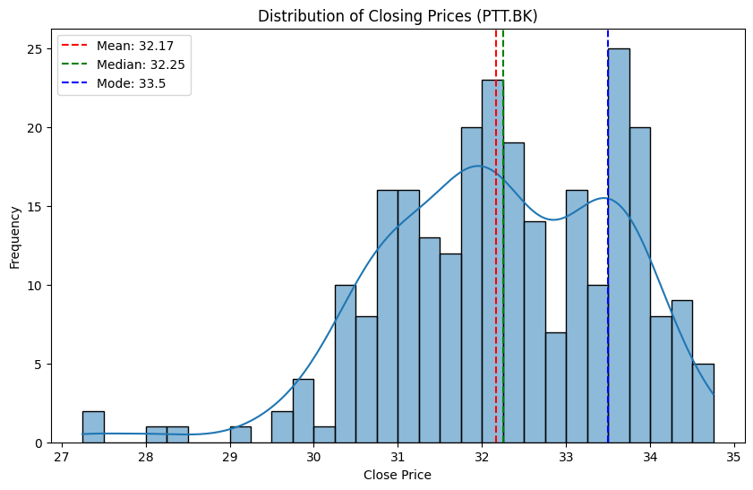
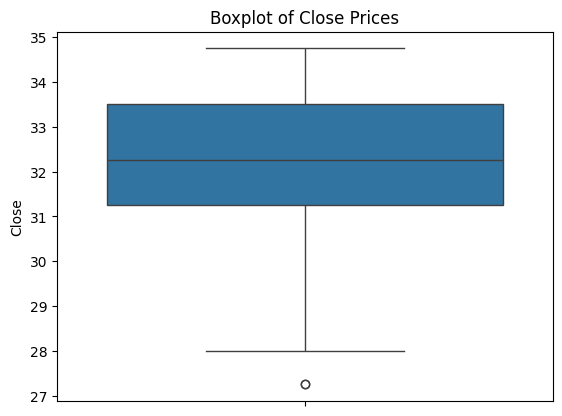
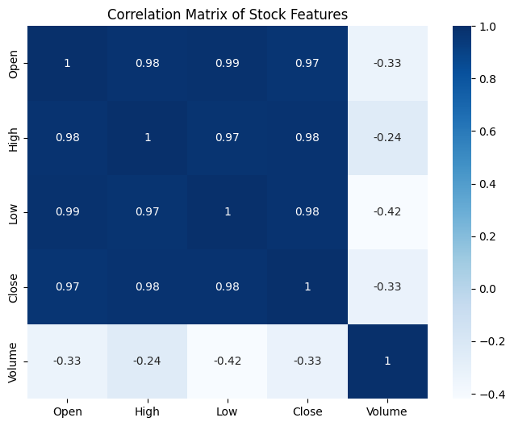
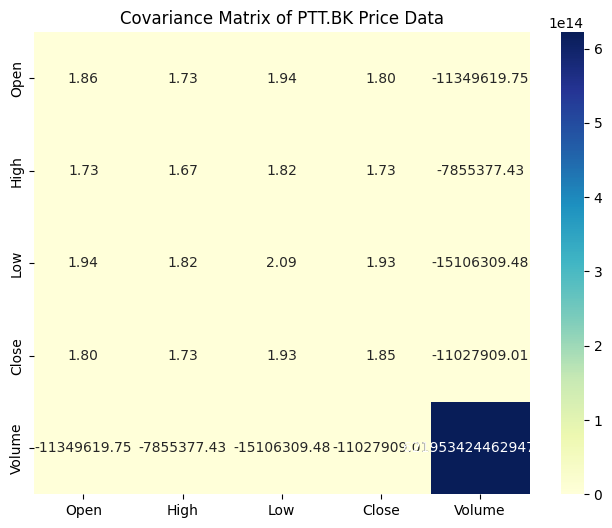
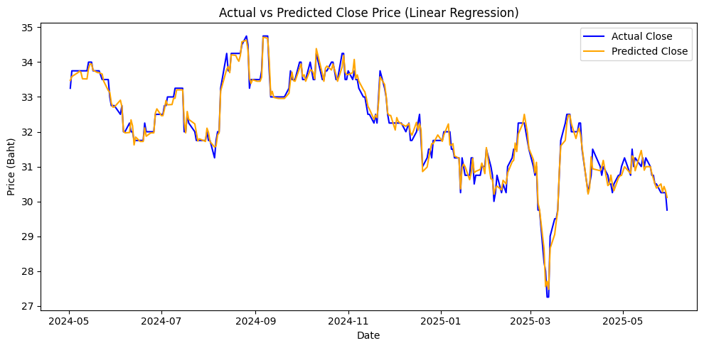

# PTT Stock Data Analysis 📊

This project showcases a full exploratory and statistical analysis on the daily stock prices of PTT Public Company Limited (Ticker: PTT.BK). The goal is to practice and demonstrate practical skills needed for a Data Analyst role, especially aligned with interview topics such as EDA, outlier detection, hypothesis testing, correlation analysis, and prediction using linear regression.

---

## ⚙️ Tools & Dataset
- **Python Libraries**: pandas, numpy, seaborn, matplotlib, scikit-learn, scipy
- **IDE**: Jupyter Notebook
- **Dataset**: `ptt_daily_price.csv` (PTT stock prices for 2025)

---

## 🎯 Objectives
- Understand the distribution and structure of stock data
- Detect outliers using IQR method
- Analyze statistical relationships (correlation & covariance)
- Test hypothesis using paired t-test
- Predict stock closing prices using linear regression
- Evaluate model performance with RMSE

---

## 📊 Step-by-Step Analysis

### 1. Exploratory Data Analysis (EDA)
- Calculated **mean**, **median**, and **mode** of `Close` price
- Plotted **histogram** to understand distribution of prices
- Interpreted shape & skewness of data

📌 Example Output:


---

### 2. Outlier Detection with IQR
- Computed Q1, Q3, and IQR on `Close` price
- Defined bounds using `1.5 * IQR` rule
- Plotted boxplot to visualize outliers

📌 Boxplot Sample:


---

### 3. Correlation & Covariance
- Used `.corr()` and `.cov()` to explore numeric relationships
- Created heatmaps for correlation and covariance
- Found **negative correlation** between Volume and Price (possible panic selling)

📌 Correlation Heatmap:


📌 Covariance Heatmap:


---

### 4. Hypothesis Testing: Paired t-test
- Compared closing prices before vs after April 2025
- Applied `scipy.stats.ttest_rel()`

**Result**:
- T-statistic: 3.000
- P-value: 0.024 → **Statistically significant change** in prices

---

### 5. Linear Regression & RMSE
- Built model using `Open`, `High`, `Low`, `Volume` to predict `Close`
- Used `LinearRegression()` from sklearn
- Computed RMSE = **0.188 Baht** (after adding more features)

📌 Regression Plot:


---

## 🔍 Summary of Findings
- **Distribution** of prices slightly skewed
- **Outliers** detected in `Close` and `Volume`
- **Negative correlation** between Volume and Price
- **Price shifts** in April shown significant by hypothesis testing
- **RMSE = 0.188 Baht** → Model captures general price trends

---

## 📸 Visual Recap (Insert Plots)
- Histogram of `Close`
- Boxplot for outliers
- Correlation/Covariance Heatmap
- Regression fit line vs actual

---

## 🧠 Learnings & Applications
- How to explore and clean financial datasets
- How to use IQR for anomaly detection
- Difference between correlation & covariance
- When to use paired t-test for comparison
- Build regression models for numeric predictions
- Interpret RMSE as evaluation metric

---

## 🚀 How to Run
```bash
jupyter notebook stock analysis.ipynb
```
Make sure to place `ptt_daily_price.csv` in the same directory.

---

> Author: **Photsawat Buanuam**  